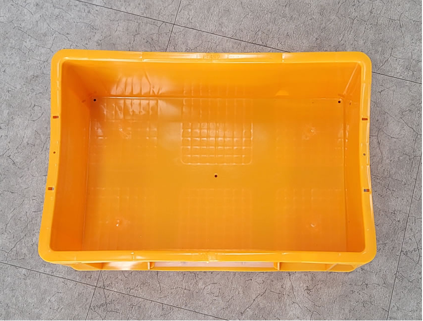
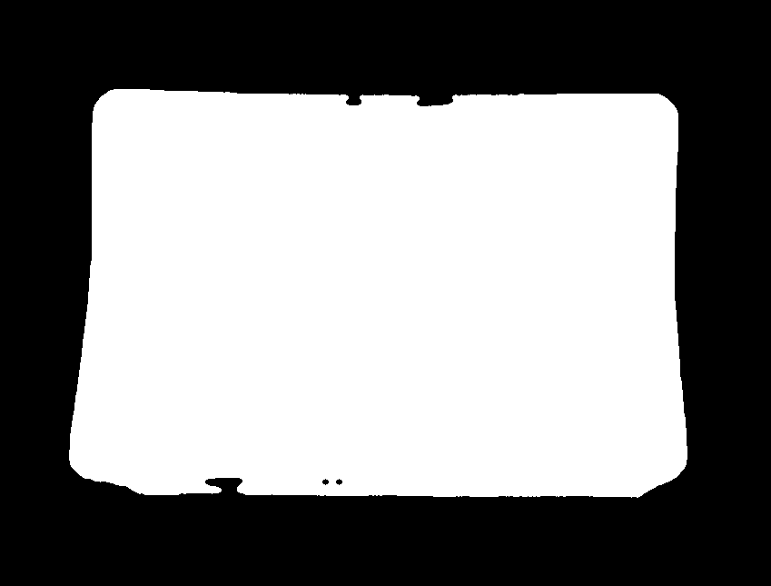
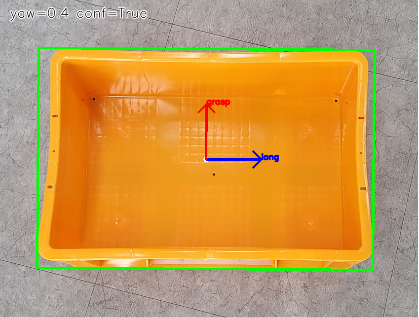
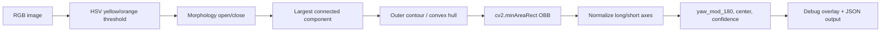
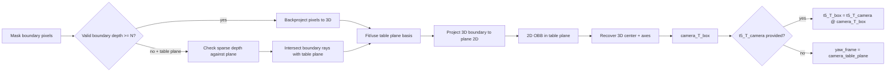

# Pallet Box Yaw Vision

RBY1 양팔 로봇이 노란 오픈탑 박스를 A 책상과 B 책상 사이에서 반복적으로 옮기는 작업을 위한 경량 vision prototype입니다.

목표는 로봇 제어 명령을 만들지 않고, 박스를 안정적으로 양쪽 긴 변에서 잡기 위해 필요한 perception 정보만 계산하는 것입니다.

- 박스 중심점
- 박스의 긴 축 yaw
- 긴 축에 수직인 grasp 축
- confidence와 실패 이유
- Phase 1에서는 카메라/T5 기준 metric pose

현재 구현은 Jetson Orin AGX에서 dependency 문제를 줄이기 위해 OpenCV + NumPy만 사용합니다. 첫 구현에서는 YOLO, FoundationPose, Open3D registration을 쓰지 않았습니다.

## 결과 미리보기

아래 3개 이미지는 현재 오프라인 smoke run으로 생성된 결과입니다.

| 입력 이미지 | HSV/connected-component 마스크 | Debug overlay |
| --- | --- | --- |
|  |  |  |

Debug overlay 해석:

- 초록색 사각형: segmented box contour에서 계산한 pixel OBB
- 흰 점: pixel OBB 중심
- 파란 화살표 `long`: 박스의 긴 축
- 빨간 화살표 `grasp`: 긴 축에 수직인 짧은 축, 즉 양손을 모을 방향
- 좌상단 텍스트: image-frame yaw와 confidence

현재 `pallet_box.png` 기준 오프라인 출력의 핵심 값:

```json
{
  "confidence": {"ok": true, "score": 0.867, "reasons": []},
  "yaw_frame": "image",
  "yaw_mod_180": 0.36034980284148743,
  "pixel_obb": {
    "center": [417.1156921386719, 322.607629776001],
    "long_length_px": 680.0494604356386,
    "short_length_px": 446.02255392882427,
    "aspect_ratio": 1.5246974720120545,
    "fill_ratio": 0.9424055550190638
  },
  "mask_stats": {
    "dominant_area": 286886,
    "dominant_fraction": 1.0,
    "significant_components": 1
  }
}
```

중요: 위 값은 Phase 0 image-frame pixel 결과입니다. centimeter 단위 정확도 주장을 하지 않습니다.

## 구현 파일 구조

```text
box_perception/
  README.md
  demo_offline.py
  recording.py
  pallet_box.png
  pallet_box_mask.png
  pallet_box_debug.png
  box_pose/
    __init__.py
    segmentation.py
    geometry.py
    visualization.py
  tests/
    test_box_pose.py
```

역할:

- `box_pose/segmentation.py`: 노란 박스 HSV segmentation, morphology, largest component filtering, mask 통계
- `box_pose/geometry.py`: pixel OBB yaw, metric RGB-D projection, table-plane fallback, confidence gates, output safety
- `box_pose/visualization.py`: OBB/center/axis debug overlay
- `demo_offline.py`: `pallet_box.png` 같은 정적 이미지용 Phase 0 CLI
- `recording.py`: ZED RGB/depth/intrinsics/timestamp recording CLI
- `tests/test_box_pose.py`: synthetic/unit/offline/metric/safety tests

## Jetson Orin AGX Installation

현재 구현의 runtime dependency는 작게 유지했습니다.

필수:

- Python 3.10 이상
- NumPy
- OpenCV Python binding, 즉 `cv2`

선택:

- `pytest`: test runner로 쓰고 싶을 때만 필요합니다. 기본 검증은 `unittest`로도 됩니다.
- ZED SDK / `pyzed`: live ZED adapter를 붙일 때만 필요합니다. 현재 offline CLI와 core geometry test에는 필요 없습니다.

### Python version 주의

이 코드는 Python 3.10 문법을 사용합니다.

예:

```python
np.ndarray | None
CameraIntrinsics | dict[str, Any]
```

따라서 JetPack 6 계열처럼 기본 Python이 3.10이면 그대로 쓰기 쉽습니다. JetPack 5 계열처럼 기본 Python이 3.8이면 두 가지 중 하나를 선택해야 합니다.

1. Miniforge/conda 등으로 Python 3.10 이상 환경을 만든다.
2. 코드의 type hint를 Python 3.8 호환 문법으로 바꾼다.

권장 경로는 1번입니다. 실제 로봇 쪽 dependency와 분리하기 쉽고, 이 prototype의 dependency가 작아서 환경 관리가 단순합니다.

### Option A: JetPack 6 / Python 3.10 system venv

Jetson의 system OpenCV를 쓰는 방식입니다. Jetson에서는 `pip install opencv-python`이 오래 걸리거나 binary 문제가 날 수 있으므로, 가능하면 JetPack/apt가 제공하는 OpenCV를 먼저 씁니다.

```bash
sudo apt-get update
sudo apt-get install -y python3-venv python3-pip python3-opencv

cd /home/kgs/workspace
python3 -m venv ~/.venvs/keti-box-pose --system-site-packages
source ~/.venvs/keti-box-pose/bin/activate

python -m pip install -U pip
python -m pip install numpy
```

설치 확인:

```bash
python - <<'PY'
import sys
import cv2
import numpy as np

print("python", sys.version)
print("opencv", cv2.__version__)
print("numpy", np.__version__)
PY
```

`python` version이 3.10 이상이어야 합니다.

### Option B: JetPack 5 / Python 3.8 기본 환경일 때

JetPack 5의 기본 Python 3.8에서 이 코드를 그대로 실행하면 syntax error가 날 수 있습니다. 이 경우 Python 3.10 이상 conda 환경을 따로 만듭니다.

Miniforge가 이미 설치되어 있다고 가정하면:

```bash
conda create -n keti-box-pose python=3.10 -y
conda activate keti-box-pose
conda install -c conda-forge numpy opencv -y
```

설치 확인:

```bash
python - <<'PY'
import sys
import cv2
import numpy as np

print("python", sys.version)
print("opencv", cv2.__version__)
print("numpy", np.__version__)
PY
```

만약 conda의 OpenCV 설치가 Jetson에서 맞지 않으면, system Python 3.10을 별도로 준비하거나 JetPack을 Python 3.10 기반으로 맞추는 편이 낫습니다. 이 prototype은 OpenCV의 CUDA 기능을 쓰지 않으므로 `cv2.inRange`, morphology, contour, `minAreaRect`가 CPU에서 정상 동작하면 충분합니다.

### Workspace 설치

별도 package install은 아직 없습니다. `box_perception` repository root에서 바로 실행합니다.

```bash
cd ~/box_perception
python demo_offline.py \
  --image pallet_box.png \
  --save-debug pallet_box_debug.png \
  --mask-output pallet_box_mask.png
```

성공 조건:

- exit code 0
- JSON의 `confidence.ok`가 `true`
- `pallet_box_debug.png` 생성
- `pallet_box_mask.png` 생성

현재 reference image 기준 기대되는 대략적 출력:

```text
yaw_frame = image
yaw_mod_180 ~= 0.36 deg
dominant_area ~= 286886
significant_components = 1
confidence.ok = true
```

### 테스트 실행

`pytest` 없이도 표준 라이브러리 `unittest`로 테스트할 수 있습니다.

```bash
cd ~/box_perception
python -m py_compile demo_offline.py recording.py box_pose/*.py tests/*.py
python -m unittest discover -s tests -v
```

`pytest`를 쓰고 싶으면:

```bash
python -m pip install pytest
python -m pytest tests -q
```

단, 현재 이 workspace의 활성 환경에서는 `pytest`가 설치되어 있지 않아 `unittest`로 검증했습니다.

### ZED SDK는 언제 필요한가

현재 구현은 아래 입력만 받으면 동작합니다.

- BGR image
- depth map in meters
- camera intrinsics
- optional `t5_T_camera`
- optional table plane

따라서 offline Phase 0와 synthetic Phase 1 test에는 ZED SDK가 필요 없습니다.

Live ZED 연동을 시작할 때만 Jetson에 맞는 Stereolabs ZED SDK와 Python API를 설치하고, adapter에서 다음 값을 뽑아 core estimator에 넘기면 됩니다.

```text
zed_rgb_bgr -> segment_yellow_box()
zed_depth_m -> estimate_metric_box()
zed_intrinsics -> CameraIntrinsics
fixed_head_pose -> t5_T_camera
```

ZED adapter를 추가하더라도 `box_pose/geometry.py`는 ZED SDK에 직접 의존하지 않게 유지하는 것이 좋습니다. 그래야 offline test와 robot/live dependency를 분리할 수 있습니다.

### 자주 나는 설치 문제

| 증상 | 원인 | 대응 |
| --- | --- | --- |
| `SyntaxError`가 `| None` 근처에서 발생 | Python 3.8 이하 | Python 3.10+ 환경 사용 |
| `ModuleNotFoundError: No module named 'cv2'` | OpenCV Python binding 없음 | `python3-opencv` 설치 또는 conda `opencv` 설치 |
| `ModuleNotFoundError: No module named 'numpy'` | NumPy 없음 | `python -m pip install numpy` 또는 conda `numpy` 설치 |
| `No module named pytest` | pytest 없음 | `unittest` 사용 또는 `python -m pip install pytest` |
| `cv2.imread(...)`가 `None` | 실행 위치/path 문제 | `/home/kgs/workspace`에서 실행하거나 `--image` 절대경로 사용 |
| OpenCV/NumPy ABI 관련 import error | system package와 pip package 혼용 | 새 venv/conda env를 만들고 한 경로로 통일 |

### NumPy 2.x와 Jetson OpenCV ABI 충돌

Jetson에서 아래와 같은 에러가 나면 OpenCV와 NumPy ABI가 맞지 않는 상태입니다.

```text
A module that was compiled using NumPy 1.x cannot be run in NumPy 2.2.6
AttributeError: _ARRAY_API not found
ImportError: numpy.core.multiarray failed to import
```

대부분의 경우 원인은 venv 안의 `numpy==2.x`가 Jetson system/apt OpenCV보다 먼저 import되는 것입니다. Jetson의 `python3-opencv` 또는 오래된 `opencv-python` wheel은 NumPy 1.x ABI로 빌드된 경우가 많으므로, 이 prototype에서는 NumPy를 1.x로 고정하는 편이 가장 단순합니다.

venv 안에서 다음처럼 정리합니다.

```bash
source .venv/bin/activate

python -m pip uninstall -y numpy
python -m pip install "numpy<2"
```

좀 더 고정하고 싶으면 Python 3.10 기준으로 다음 버전을 사용합니다.

```bash
python -m pip install "numpy==1.26.4"
```

그 다음 다시 확인합니다.

```bash
python - <<'PY'
import sys
import cv2
import numpy as np

print("python", sys.version)
print("opencv", cv2.__version__)
print("numpy", np.__version__)
PY
```

만약 여전히 깨지면 venv 안에 pip OpenCV와 apt OpenCV가 섞여 있을 수 있습니다. 아래를 확인합니다.

```bash
python -m pip list | grep -E "numpy|opencv"
python - <<'PY'
import cv2
print(cv2.__file__)
PY
```

`opencv-python`, `opencv-contrib-python`, `opencv-python-headless`가 pip로 설치되어 있고 system OpenCV를 쓰고 싶다면 제거합니다.

```bash
python -m pip uninstall -y opencv-python opencv-contrib-python opencv-python-headless
```

그 후 venv를 system package 접근 가능하게 다시 만드는 방식이 안정적입니다.

```bash
deactivate
rm -rf .venv
python3 -m venv .venv --system-site-packages
source .venv/bin/activate
python -m pip install "numpy<2"
```

이 에러는 이 perception 코드의 문제가 아니라 Jetson OpenCV 바이너리와 NumPy major version이 맞지 않아 생기는 설치 문제입니다.

### RBY1 SDK와 같은 venv에 넣지 않는 것을 권장

Jetson에서 다음과 같은 dependency conflict가 보일 수 있습니다.

```text
rby1-sdk 0.10.0 requires numpy<3.0.0,>=2.0.1,
but you have numpy 1.26.4 which is incompatible.
```

이 경우 현재 venv는 OpenCV 4.5.4 import를 위해 NumPy 1.26.4를 쓰고 있고, `rby1-sdk`는 NumPy 2.x를 요구하는 상태입니다. 두 조건은 같은 Python environment에서 동시에 만족하기 어렵습니다.

권장 구조:

```text
vision venv:
  Python 3.10
  OpenCV 4.5.4
  NumPy 1.26.4
  KETI estimator

robot/control venv:
  rby1-sdk
  NumPy 2.x
  robot command / motion stack
```

이 repository의 estimator는 perception-only로 유지했으므로 robot SDK와 같은 process에 묶을 필요가 없습니다. Vision process는 `camera_T_box`, `t5_T_box`, `long_axis`, `grasp_axis`, `confidence` 같은 perception result만 JSON, socket, ROS topic, shared file 등으로 넘기고, robot/control process가 별도 환경에서 grasp planning과 RBY1 SDK command를 처리하는 구조가 안전합니다.

현재 vision venv에서 아래 확인이 되면 이 estimator 실행에는 충분합니다.

```text
python 3.10.x
opencv 4.5.4
numpy 1.26.4
```

## 전체 파이프라인



Phase 1 metric path는 depth와 intrinsics가 있을 때 별도로 동작합니다.



## Phase 0: Offline Pixel POC

Phase 0는 단일 RGB 이미지에서 image-frame 기준의 pixel center와 yaw를 계산합니다.

### 1. HSV segmentation

구현: `segment_yellow_box()` in `box_pose/segmentation.py`

기본 HSV threshold:

```python
lower_hsv = (5, 70, 70)
upper_hsv = (45, 255, 255)
```

처리 순서:

1. BGR 이미지를 HSV로 변환
2. `cv2.inRange()`로 yellow/orange 영역 추출
3. elliptical kernel size 7로 morphology open
4. 같은 kernel로 morphology close
5. connected components 계산
6. 가장 큰 component만 최종 mask로 사용
7. `MaskStats` 반환

`MaskStats` 필드:

```python
MaskStats(
    image_area: int,
    total_mask_area: int,
    dominant_area: int,
    dominant_fraction: float,
    significant_components: int,
)
```

의도:

- 작은 노란 잡음은 morphology와 largest component filtering으로 제거
- 책상 위에 박스만 있다는 현재 조건에서는 HSV가 YOLO보다 훨씬 가볍고 dependency risk가 낮음
- 이후 조명 변화가 커지면 YOLO segmentation을 Phase 2 fallback으로 붙일 수 있음

### 2. Pixel OBB와 yaw 계산

구현: `estimate_pixel_box()` in `box_pose/geometry.py`

처리 순서:

1. binary mask를 0/255 `uint8`로 정규화
2. 가장 큰 contour 선택
3. `cv2.minAreaRect(contour)`로 oriented bounding box 계산
4. `cv2.boxPoints(rect)`로 4개 corner를 얻음
5. corner 간 edge 길이를 직접 계산
6. 가장 긴 edge를 `long_axis_image`로 선택
7. 그에 직교하는 짧은 edge를 `grasp_axis_image`로 선택
8. `atan2(long_axis.y, long_axis.x) % 180`으로 `yaw_mod_180` 계산

여기서 중요한 점은 `cv2.minAreaRect`의 angle/width/height를 그대로 믿지 않는다는 것입니다. OpenCV는 각도에 따라 width/height가 swap되는 경우가 있어서, 구현은 항상 corner edge 길이를 다시 계산해서 가장 긴 edge를 long axis로 정합니다.

그래서 박스가 0도, 90도 근처, 179도 근처에 있어도 long/short axis identity가 유지됩니다. 단, 박스가 거의 정사각형처럼 보이면 long/short 구분 자체가 불안정하므로 confidence를 낮춥니다.

### 3. 180도 ambiguity 처리

박스 grasp 관점에서는 yaw 0도와 yaw 180도는 같은 긴 축입니다.

그래서 yaw는 항상 modulo 180으로 표현합니다.

```python
yaw_mod_180 = atan2(long_axis_y, long_axis_x) % 180.0
```

예:

- 0도와 180도는 같은 축
- 1도와 181도는 같은 축
- 179도와 -1도는 같은 축

박스를 긴 양쪽 변에서 집는 작업에서는 이 ambiguity가 문제가 되지 않습니다. 어느 손이 왼쪽/오른쪽을 잡을지는 downstream grasp planner가 로봇 base 기준 위치나 현재 hand 위치를 보고 정하면 됩니다.

### 4. Phase 0 출력

`PixelBoxEstimate.to_dict()`는 perception-only field만 반환합니다.

```json
{
  "pixel_obb": {
    "center": [x_px, y_px],
    "corners": [[x0, y0], [x1, y1], [x2, y2], [x3, y3]],
    "long_length_px": 680.0,
    "short_length_px": 446.0,
    "aspect_ratio": 1.52,
    "fill_ratio": 0.94
  },
  "mask_stats": {...},
  "confidence": {"ok": true, "score": 0.867, "reasons": []},
  "yaw_mod_180": 0.36,
  "yaw_frame": "image",
  "long_axis_image": [0.99998, 0.00629],
  "grasp_axis_image": [0.00629, -0.99998],
  "failure_reasons": []
}
```

Phase 0에는 아래 field가 없습니다.

- `camera_T_box`
- `t5_T_box`
- `center_m`
- `metric_tolerance_cm`

이렇게 한 이유는 단일 RGB 이미지의 perspective OBB만으로는 책상 위 실제 중심을 cm 단위로 보장할 수 없기 때문입니다.

## Phase 1: Metric RGB-D Estimator

Phase 1는 ZED 같은 RGB-D 카메라에서 depth map과 camera intrinsics가 있을 때 사용하는 metric estimator입니다.

구현: `estimate_metric_box()` in `box_pose/geometry.py`

입력:

```python
estimate_metric_box(
    mask: np.ndarray,
    depth_m: np.ndarray,
    intrinsics: CameraIntrinsics | dict,
    t5_T_camera: np.ndarray | None = None,
    table_plane: tuple[np.ndarray, np.ndarray] | None = None,
    min_boundary_depth_points: int = 30,
)
```

`CameraIntrinsics`:

```python
CameraIntrinsics(
    fx: float,
    fy: float,
    cx: float,
    cy: float,
)
```

### 왜 boundary/rim depth만 쓰나?

박스 안에는 3kg를 채우기 위한 물품이 들어갈 예정이고, 물품은 박스 윗단보다 낮게 둘 계획입니다.

그래도 전체 mask 내부 point cloud를 PCA하면 내부 물품의 depth가 섞여 yaw/center를 오염시킬 수 있습니다. 그래서 metric pose는 full-mask PCA가 아니라 외곽 contour/convex hull boundary만 사용합니다.

처리 순서:

1. mask의 largest contour를 찾음
2. contour의 convex hull boundary pixel을 그림
3. boundary pixel의 valid depth만 backproject
4. valid boundary depth가 충분하면 그 3D point로 진행
5. valid boundary depth가 부족하고 `table_plane`이 있으면 ray-plane intersection 사용
6. sparse valid depth가 하나라도 있으면 table plane과 3cm 이내로 일치하는지 먼저 검사
7. 불일치하면 `depth_plane_inconsistent`로 fail closed
8. table plane도 유효하지 않으면 `ok=false`

### Table-plane fallback의 fail-safe 조건

Depth가 sparse할 때 table plane fallback을 쓰지만, 아무 plane이나 무조건 믿지는 않습니다.

검사:

```python
points_match_plane(points, table_plane, max_error_m=0.03)
```

즉 boundary depth sample이 조금이라도 있으면, 그 sample들이 주어진 table plane에서 3cm 이내인지 확인합니다.

실패 reason:

- `insufficient_boundary_depth`: boundary depth가 부족하고 table plane도 없음
- `depth_plane_inconsistent`: sparse depth와 table plane이 불일치
- `invalid_table_plane_fallback`: ray-plane intersection 결과가 유효하지 않음

### Metric OBB 계산

3D boundary point가 확보되면:

1. table plane normal과 origin을 정함
2. plane 위의 2D basis `u_axis`, `v_axis`를 만듦
3. 3D boundary point를 plane 2D coordinate로 projection
4. projected 2D point에 `cv2.minAreaRect` 적용
5. 2D OBB center와 long/short axis를 다시 3D로 복원
6. `camera_T_box` 생성

`camera_T_box` 축 정의:

```text
camera_T_box[:3, 0] = short/grasp axis
camera_T_box[:3, 1] = long axis
camera_T_box[:3, 2] = table normal
camera_T_box[:3, 3] = box center
```

즉 box local frame에서:

- X축: grasp 방향, 박스 짧은 방향
- Y축: 박스 긴 방향
- Z축: table normal 방향

### T5 transform

`t5_T_camera`가 주어지면:

```python
t5_T_box = t5_T_camera @ camera_T_box
```

그리고 yaw frame은 `"t5"`로 표시합니다.

`t5_T_camera`가 없으면:

```text
yaw_frame = "camera_table_plane"
```

이렇게 frame label을 명시해서, camera 기준 yaw와 robot/T5 기준 yaw를 섞지 않게 했습니다.

## Confidence gates

현재 기본 confidence gate는 보수적으로 잡았습니다.

| Gate | 기본값 | 실패 reason |
| --- | ---: | --- |
| dominant component 면적 / image 면적 | `>= 0.03` | `mask_area_too_small` |
| dominant component / total mask | `>= 0.70` | `dominant_component_too_weak` |
| OBB aspect ratio | `>= 1.25` | `aspect_ratio_ambiguous` |
| contour fill ratio | `>= 0.45` | `partial_or_sparse_contour` |
| significant components | `<= 3` | `mask_fragmented` |
| metric boundary depth samples | `>= 30` or valid table fallback | `insufficient_boundary_depth` |
| metric projected aspect ratio | `>= 1.25` | `metric_aspect_ratio_ambiguous` |
| metric short extent | `>= 0.02 m` | `boundary_support_biased` |
| still-frame center spread | `<= 0.01 m` | `center_spread_too_large` |
| still-frame yaw spread | `<= 5 deg` | `yaw_spread_too_large` |

`confidence.score`는 gate를 통과하면 aspect ratio와 fill ratio를 반영해서 0.5 이상으로 계산하고, 실패 reason이 있으면 0.0입니다.

## Still-frame spread check

실제 ZED live frame에서는 한 프레임만 보고 바로 robot-facing integration으로 넘기면 위험합니다.

그래서 다음 helper를 추가했습니다.

```python
evaluate_still_frame_spread(
    centers_m,
    yaws_deg,
    max_center_spread_m=0.01,
    max_yaw_spread_deg=5.0,
)
```

의도:

- 3-5개 still frame에서 center spread가 1cm 이하인지 확인
- yaw spread가 5도 이하인지 확인
- yaw는 modulo 180 기준으로 spread를 계산하므로 179도와 1도는 서로 가까운 방향으로 처리

## Output safety

이 패키지는 perception prototype입니다. 로봇을 움직이는 명령을 만들지 않습니다.

`safe_output_dict()`는 아래 field가 output에 들어가면 예외를 발생시킵니다.

```python
FORBIDDEN_OUTPUT_FIELDS = {
    "address",
    "command_recommended",
    "power",
    "servo",
    "target_t5_T_ee",
}
```

중첩 dict/list 내부에 있어도 탐지합니다.

테스트에서는 아래처럼 직접 검증합니다.

```python
with self.assertRaises(ValueError):
    safe_output_dict({"target_t5_T_ee": np.eye(4).tolist()})

with self.assertRaises(ValueError):
    safe_output_dict({"debug": {"command": {"target_t5_T_ee": np.eye(4).tolist()}}})
```

허용되는 것은 pose/axis/confidence 같은 perception field입니다. RBY1 SDK call, servo on/off, power, end-effector target command는 이 repo의 책임 밖입니다.

## 실행 방법

현재 workspace root에서 실행:

```bash
python demo_offline.py \
  --image pallet_box.png \
  --save-debug pallet_box_debug.png \
  --mask-output pallet_box_mask.png
```

성공하면 JSON이 stdout으로 출력되고, exit code 0을 반환합니다.

Confidence가 실패하면 JSON은 출력하지만 exit code 2를 반환합니다.

## ZED 녹화 데이터 만들기

나중에 박스 중심점과 회전각을 안정적으로 테스트/시각화하려면 live camera frame을 바로 알고리즘에 물리기 전에 재현 가능한 recording dataset을 먼저 만들어 두는 편이 좋습니다.

`recording.py`는 ZED에서 아래 정보를 동기화해서 한 session directory에 저장합니다.

- left RGB image
- depth map in meters
- camera intrinsics
- timestamp
- frame index
- per-frame depth statistics
- recording config
- camera metadata

저장 구조:

```text
recordings/<session_name>/
  manifest.json
  index.jsonl
  rgb/
    frame_000000.jpg
    frame_000001.jpg
    ...
  depth/
    frame_000000.depth.npz
    frame_000001.depth.npz
    ...
```

`recordings/`는 `.gitignore`에 들어가 있으므로 대용량 녹화 데이터가 git commit에 섞이지 않습니다.

### 기본 녹화 명령

Jetson에서 ZED SDK Python API가 설치되어 있고 `pyzed.sl` import가 되는 환경에서 실행합니다.

```bash
cd ~/box_perception
source .venv/bin/activate

python recording.py \
  --output-root recordings \
  --session-name box_table_test_001 \
  --resolution HD720 \
  --depth-mode ULTRA \
  --fps 10 \
  --duration-sec 30
```

또는 frame 수로 멈추려면:

```bash
python recording.py \
  --output-root recordings \
  --session-name box_table_test_001 \
  --resolution HD720 \
  --depth-mode ULTRA \
  --fps 10 \
  --max-frames 300
```

둘 중 하나의 stop condition은 반드시 필요합니다.

- `--duration-sec`
- `--max-frames`

### 권장 녹화 조건

처음에는 아래 정도로 시작합니다.

```bash
python recording.py \
  --output-root recordings \
  --session-name desk_a_box_static_001 \
  --resolution HD720 \
  --depth-mode ULTRA \
  --fps 10 \
  --duration-sec 20
```

권장 이유:

- `HD720`: 처리/저장 부담과 해상도의 균형이 좋음
- `ULTRA`: Jetson에서 `NEURAL` depth mode보다 dependency surprise가 적음
- `fps 10`: 한 순간 pose 검증과 still-frame stability 확인에는 충분함
- `duration-sec 20`: 정지 박스, A/B 책상 위치, 조명 변화 테스트에 적당함

Preview가 필요하면:

```bash
python recording.py \
  --output-root recordings \
  --session-name desk_a_box_static_001 \
  --resolution HD720 \
  --depth-mode ULTRA \
  --fps 10 \
  --duration-sec 20 \
  --preview
```

Preview 창에서 `q`를 누르면 녹화를 멈춥니다. SSH만 쓰는 환경에서는 `--preview`를 쓰지 않는 편이 안전합니다.

### 저장 파일 의미

`manifest.json`에는 recording 전체 metadata가 들어갑니다.

중요 필드:

```json
{
  "format_version": "box-perception-recording-v1",
  "config": {
    "resolution": "HD720",
    "depth_mode": "ULTRA",
    "fps": 10
  },
  "camera": {
    "serial_number": 12345678,
    "resolution": {"width": 1280, "height": 720}
  },
  "intrinsics": {
    "fx": 0.0,
    "fy": 0.0,
    "cx": 0.0,
    "cy": 0.0
  }
}
```

`index.jsonl`은 frame마다 한 줄씩 기록됩니다.

예:

```json
{"frame_id":0,"rgb_path":"rgb/frame_000000.jpg","depth_path":"depth/frame_000000.depth.npz","wall_time":"2026-07-01T00:00:00.000Z","depth_stats":{"valid_count":123456,"min_m":0.4,"max_m":2.1,"mean_m":1.0}}
```

Depth 파일은 기본적으로 compressed NumPy archive입니다.

```python
depth_m = np.load("frame_000000.depth.npz")["depth_m"]
```

저장 속도가 부족하면 `--depth-format npy`를 쓸 수 있습니다. 파일은 더 커지지만 압축 비용이 줄어듭니다.

```bash
python recording.py \
  --output-root recordings \
  --session-name fast_depth_test \
  --resolution HD720 \
  --depth-mode ULTRA \
  --fps 10 \
  --max-frames 300 \
  --depth-format npy
```

### 나중에 분석에 쓰는 방식

녹화 데이터는 나중에 다음 흐름으로 재사용합니다.

```python
import json
from pathlib import Path

import cv2
import numpy as np

from box_pose import CameraIntrinsics, estimate_metric_box, estimate_pixel_box, segment_yellow_box

session = Path("recordings/desk_a_box_static_001")
manifest = json.loads((session / "manifest.json").read_text())
intr = CameraIntrinsics.from_mapping(manifest["intrinsics"])

with (session / "index.jsonl").open() as f:
    first = json.loads(next(f))

image = cv2.imread(str(session / first["rgb_path"]), cv2.IMREAD_COLOR)
depth = np.load(session / first["depth_path"])["depth_m"]

mask, stats = segment_yellow_box(image)
pixel_estimate = estimate_pixel_box(mask, stats)
metric_estimate = estimate_metric_box(mask, depth, intr)
```

아직 이 replay/visualization CLI는 만들지 않았습니다. 지금 `recording.py`는 좋은 RGB-D dataset을 남기는 첫 단계입니다.

## Python에서 직접 사용

Phase 0:

```python
import cv2

from box_pose import estimate_pixel_box, segment_yellow_box

image = cv2.imread("pallet_box.png", cv2.IMREAD_COLOR)
mask, stats = segment_yellow_box(image)
estimate = estimate_pixel_box(mask, stats)

print(estimate.to_dict())
```

workspace root에서 바로 import하려면 `KETI`를 `PYTHONPATH`에 넣어야 합니다.

```bash
PYTHONPATH=KETI python your_script.py
```

Phase 1 synthetic usage:

```python
import numpy as np

from box_pose import CameraIntrinsics, estimate_metric_box

intr = CameraIntrinsics(fx=100.0, fy=100.0, cx=80.0, cy=80.0)
estimate = estimate_metric_box(
    mask=mask,
    depth_m=depth_m,
    intrinsics=intr,
    table_plane=(np.array([0.0, 0.0, 1.0]), np.array([0.0, 0.0, 1.0])),
)

if estimate.confidence.ok:
    camera_T_box = estimate.camera_T_box
    long_axis_camera = estimate.long_axis_camera
    grasp_axis_camera = estimate.grasp_axis_camera
else:
    print(estimate.failure_reasons)
```

## 테스트

현재 검증한 명령:

```bash
python -m py_compile demo_offline.py recording.py box_pose/*.py tests/*.py
python -m unittest discover -s tests -v
python demo_offline.py --image pallet_box.png --save-debug pallet_box_debug.png --mask-output pallet_box_mask.png
```

결과:

- `py_compile`: PASS
- `unittest`: PASS, 29/29
- offline smoke: PASS, `confidence.ok=true`, `yaw_mod_180=0.36034980284148743`
- Architect verifier: APPROVE

현재 활성 Python environment에는 `pytest`가 설치되어 있지 않아 아래 명령은 실행되지 않았습니다.

```bash
python -m pytest tests -q
```

실패:

```text
No module named pytest
```

`unittest`만으로도 동일 테스트 파일은 모두 통과했습니다.

## 테스트가 커버하는 것

`tests/test_box_pose.py`는 다음 항목을 검증합니다.

- HSV segmentation이 dominant yellow box를 유지하고 작은 yellow noise를 제거
- synthetic rotated rectangle yaw가 +/-2도 이내
- 0/1/89/90/91/179도 근처 yaw boundary
- `cv2.minAreaRect` width/height swap에도 long axis identity 유지
- long/grasp axis 2D orthogonality
- near-square box는 low confidence
- tiny mask는 `mask_area_too_small`
- sparse/partial contour는 `partial_or_sparse_contour`
- fragmented mask는 `mask_fragmented`
- Phase 0 output은 image-frame only이며 metric field 없음
- unsafe robot command field 차단
- 실제 `pallet_box.png` segmentation/OBB smoke
- metric RGB-D projection의 center/yaw/axis/physical dimension
- boundary depth만 사용하고 내부 depth 오염을 피함
- spatially biased boundary depth는 실패
- table-plane fallback 성공/실패/불일치
- `t5_T_box == t5_T_camera @ camera_T_box`
- depth support 부족 실패
- still-frame center/yaw spread gate

## 왜 이 접근을 선택했나

현재 작업 조건:

- 책상 위에 박스만 있음
- 박스는 강한 yellow/orange 색
- ZED가 머리에 고정각도로 장착됨
- 박스 내부 물품은 윗단보다 낮게 둘 예정
- 필요한 것은 full 6D object pose가 아니라 long-axis yaw와 center
- tracking은 필요 없고 한 순간의 yaw만 필요
- Jetson Orin AGX에서 dependency issue를 줄이는 것이 중요

따라서 첫 구현은 learned model 없이 deterministic geometry로 충분히 시작할 수 있습니다.

FoundationPose를 바로 쓰지 않은 이유:

- full 6D pose에는 과함
- one-shot yaw/center만 필요
- TensorRT/CUDA/asset dependency가 커짐

Open3D reference registration을 쓰지 않은 이유:

- 열린 박스는 내부/외곽 관측 상태가 viewpoint와 내용물에 따라 달라짐
- reference 한 장 기반 SE(3) matching은 현장 변화에 취약

YOLO segmentation을 바로 쓰지 않은 이유:

- 현재 장면 제약에서는 HSV가 더 가볍고 빠름
- 학습/export/TensorRT 변환/Jetson 배포 이슈가 없음
- 나중에 조명/배경/다중 객체 때문에 HSV가 깨질 때 같은 geometry backend 앞단만 YOLO mask로 교체 가능

## 현재 한계

1. Phase 0는 pixel/image-frame yaw만 제공합니다.
   - 실제 로봇 grasp target으로 쓰려면 Phase 1 metric path가 필요합니다.

2. HSV threshold는 조명 변화에 민감할 수 있습니다.
   - 현재 `lower_hsv=(5,70,70)`, `upper_hsv=(45,255,255)`입니다.
   - 실험실 조명이 바뀌면 threshold 조정 또는 YOLO mask fallback이 필요할 수 있습니다.

3. Live ZED adapter는 아직 구현하지 않았습니다.
   - 현재는 RGB image, depth map, intrinsics를 함수에 넣는 core estimator까지만 있습니다.

4. Table plane은 외부에서 제공하거나 valid boundary depth로 plane fit해야 합니다.
   - ZED live integration 때 table plane calibration/estimation 방식을 정해야 합니다.

5. Metric dimension fields는 dataclass 내부에는 있지만 `to_dict()` output에는 포함하지 않았습니다.
   - PRD의 output contract를 perception pose 중심으로 좁게 유지하기 위한 선택입니다.
   - downstream에서 long/short physical size가 필요하면 output contract에 명시적으로 추가하면 됩니다.

6. 이 패키지는 grasp point를 만들지 않습니다.
   - 양 end-effector 목표 위치, approach vector, force command, collision check는 downstream motion/grasp planner 책임입니다.

## Live ZED로 확장할 때 필요한 다음 단계

1. ZED frame capture adapter 추가
   - RGB BGR image
   - depth in meters
   - camera intrinsics

2. Head-mounted ZED의 `t5_T_camera` 확정
   - fixed head pose preset 사용 또는 calibration 결과 입력

3. Table plane 확보
   - 고정 책상 높이/normal을 T5 frame에서 알고 있으면 camera frame으로 변환
   - 또는 boundary/table samples로 plane fit

4. 3-5개 still frame sampling
   - `evaluate_still_frame_spread()`로 center/yaw 안정성 확인

5. Metric output validation
   - center spread <= 1cm
   - yaw spread <= 5도
   - debug overlay와 depth projection 시각 확인

6. 그 다음에만 grasp planner와 연결
   - 이 estimator는 `camera_T_box`/`t5_T_box`/axis만 넘기고 robot command는 만들지 않음

## 자주 볼 failure reasons

| Reason | 의미 | 대응 |
| --- | --- | --- |
| `no_contour` | mask에서 contour를 찾지 못함 | HSV threshold, image input 확인 |
| `mask_area_too_small` | dominant object가 이미지의 3% 미만 | threshold, 거리, crop 확인 |
| `dominant_component_too_weak` | mask가 여러 객체/잡음으로 분산됨 | morphology, threshold, 배경 확인 |
| `mask_fragmented` | 큰 component가 너무 많음 | segmentation 품질 확인 |
| `aspect_ratio_ambiguous` | long/short 구분이 어려움 | viewpoint, occlusion, box shape 확인 |
| `partial_or_sparse_contour` | contour fill ratio가 낮음 | mask 구멍, partial detection 확인 |
| `insufficient_boundary_depth` | boundary depth가 부족하고 fallback 없음 | ZED depth mode/table plane 확인 |
| `depth_plane_inconsistent` | sparse depth와 table plane이 불일치 | plane calibration/depth 품질 확인 |
| `invalid_table_plane_fallback` | ray-plane intersection이 유효하지 않음 | plane normal/origin 방향 확인 |
| `boundary_support_biased` | depth support가 한쪽 edge에 치우침 | depth mask/boundary sampling 확인 |
| `center_spread_too_large` | still-frame center가 1cm 이상 흔들림 | frame 안정성/segmentation/depth 확인 |
| `yaw_spread_too_large` | still-frame yaw가 5도 이상 흔들림 | long-axis 안정성/near-square/perspective 확인 |

## Grasp planner에 넘길 때의 해석

이 estimator가 주는 핵심 axis는 다음과 같이 쓰면 됩니다.

```text
long_axis:  박스의 긴 방향
grasp_axis: 양쪽 그리퍼가 서로 모일 방향
center:     박스 중심
```

양팔 grasp의 개념적 target은 downstream에서 보통 이렇게 만들 수 있습니다.

```text
left/right grasp side = center +/- grasp_axis * half_width
approach direction    = -/+ grasp_axis
hand assignment       = robot base 기준 좌우 또는 현재 hand 거리로 결정
```

하지만 이 repo는 위 target을 직접 출력하지 않습니다. 특히 `target_t5_T_ee` 같은 end-effector command field는 safety contract상 금지했습니다.

## 현재 완료 상태

완료된 것:

- Phase 0 offline HSV + OBB estimator
- 실제 `pallet_box.png` debug overlay
- Phase 1 metric RGB-D geometry core
- ZED RGB/depth/intrinsics/timestamp recording CLI
- table-plane fallback과 inconsistency reject
- still-frame spread confidence helper
- perception-only output safety
- unit/offline/synthetic metric/recording tests

아직 남은 것:

- live ZED adapter
- recording replay/visualization CLI
- 실제 ZED depth/intrinsics 연결
- fixed head `t5_T_camera` calibration 연결
- table plane live estimation 또는 calibration source
- downstream grasp planner integration
- 필요 시 YOLO segmentation fallback
